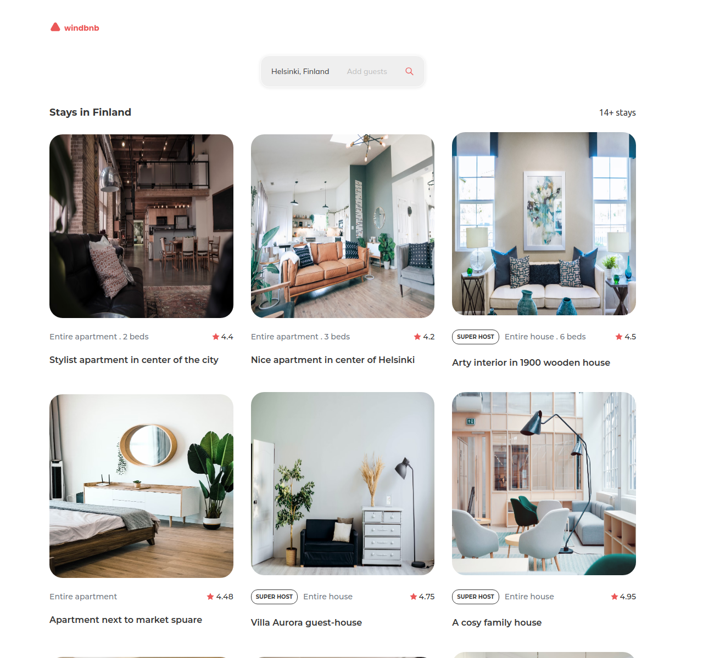
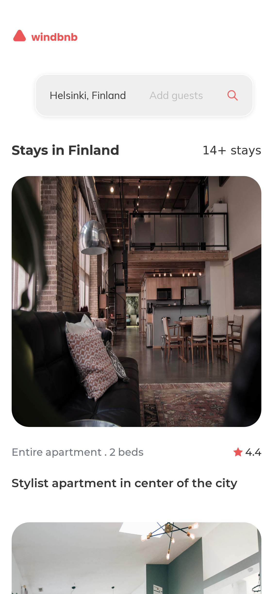

<!-- Please update value in the {}  -->

<h1 align="center">Windbnb</h1>

<div align="center">
   Solution for a challenge from  <a href="http://devchallenges.io" target="_blank">Devchallenges.io</a>.
</div>

<div align="center">
  <h3>
    <a href="https://windbnb-6zn.pages.dev/">
      Demo
    </a>
    <span> | </span>
    <a href="https://github.com/brandovidal/input-component">
      Solution
    </a>
    <span> | </span>
    <a href="https://legacy.devchallenges.io/challenges/3JFYedSOZqAxYuOCNmYD">
      Challenge
    </a>
  </h3>
</div>

<!-- TABLE OF CONTENTS -->

## Table of Contents

- [Overview](#overview)
  - [Built With](#built-with)
- [Features](#features)
- [How to use](#how-to-use)
- [Contact](#contact)
- [Acknowledgements](#acknowledgements)

<!-- OVERVIEW -->

## Overview

_Screenshot Laptop_



_Screenshot Mobile_



### Built With

<!-- This section should list any major frameworks that you built your project using. Here are a few examples.-->

- [HTML5](https://html5.org/)
- [CSS](https://developer.mozilla.org/es/docs/Web/CSS)
- [React](https://reactjs.org/)
- [Vue.js](https://vuejs.org/)
- [Tailwind](https://tailwindcss.com/)

## Features

<!-- List the features of your application or follow the template. Don't share the figma file here :) -->

This application/site was created as a submission to a [DevChallenges](https://devchallenges.io/challenges) challenge. The [challenge](https://devchallenges.io/challenges/ohgVTyJCbm5OZyTB2gNY) was to build an application to complete the given user stories.

- ✅ User story: I can see a list of properties
- ✅ User story: I can see the property card with a name, rating, apartment type, and super host
- ✅ User story: I can open the filter drawer
- ✅ User story: I can filter properties by location and number of guests
- ✅ User story: I can see the number of filtered items
- ✅ User story: I can see pages following given designs

## How To Use

To clone and run this application, you'll need [Git](https://git-scm.com) and [Node.js](https://nodejs.org/en/download/) (which comes with [npm](http://npmjs.com)) installed on your computer. From your command line:

### Clone this repository

```bash
git clone https://github.com/brandovidal/input-component.git
```

### Install dependencies

```bash
pnpm install
```

### Run the app

```bash
pnpm run dev
```

### Deploy app

```bash
pnpm run build
```

### Preview deploy

```bash
pnpm run preview
```

## Acknowledgements

<!-- This section should list any articles or add-ons/plugins that helps you to complete the project. This is optional but it will help you in the future. For exmpale -->

- [Steps to replicate a design with only HTML and CSS](https://devchallenges-blogs.web.app/how-to-replicate-design/)
- [Node.js](https://nodejs.org/)
- [Marked - a markdown parser](https://github.com/chjj/marked)

## Contact

- GitHub [@brandovidal](https://github.com/brandovidal)
- Twitter [@brandovidal](https://twitter.com/_brandovidal)